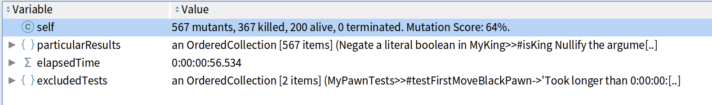

# Rapport Task2 - AVL

## Mutation

Analyse :

```ruby
testCases :=  { MyPawnTests }.
classesToMutate := { MyPawn }.

analysis := MTAnalysis new
    testClasses: testCases;
    classesToMutate: classesToMutate.

analysis run.
analysis generalResult mutationScore.
analysis generalResult.
```

J'obtient sur ma classe MyPawn : 58 mutant survivants principalement sur la méthode `targetSquaresLegal:`

Après avoir ajouté quelques tests supplémentaires aux regards des différents mutants vivants, j'ai obtenu un mutation score de 87 sur l'analyse de la classe MyPawn.

Sur les quelques mutants vivants, il s'agit de mutant équivalent avec en majorité l'utilisation de `yourself`.

## Analyse générale

À ce stade je décide de faire une analyse générale avec toutes les classes de pièce contenant des tests :

```ruby
testCases :=  { MyPawnTests. MyRookTests. MyBishopTests. MyKingTest }.
classesToMutate := { MyPawn . MyRook . MyBishopTests . MyKing }.

analysis := MTAnalysis new
    testClasses: testCases;
    classesToMutate: classesToMutate.

analysis run.
Transcript show: analysis generalResult mutationScore.
analysis generalResult.
```

Résultat:



Je pense à classer les mutants vivants par méthode pour pouvoir en tuer le plus possible

```ruby
((analysis generalResult aliveMutants)
 groupedBy: [ :m |m mutant originalMethod ])
  associations sorted: [ :a :b | a value size > b value size ]
```

Les deux méthodes en haut du classement sont celles de la clase `MyKing` -> `targetSquaresLegal:` & `basicTargetSquare:`

J'effectue un test basique dans `MyKingTests`

```ruby
testLegalMoves

 | king board squares|
 board := MyChessBoard empty.
 board at: 'e4' put: (king := MyKing white).

 squares := king basicTargetSquares.
 
 self assertCollection: squares 
  includesAll: (#( d5 e5 f5 f4 d4 d3 e3 f3) collect: [ :name |
     board at: name ])
```

Je lance une nouvelle analyse :


Avec deux nouveaux tests de mouvements `testMoveWithSameColorObstacle` & `testMoveWithSameColorObstacleBis`


Exemple de mutant tué :

Méthode d'origine:

```ruby
basicTargetSquares
 "The king can move one square on each direction including diagonals"

 ^ {
    (square ifNotNil: #right).
    (square up ifNotNil: #right).
    (square ifNotNil: #up).
    (square up ifNotNil: #left).
    (square ifNotNil: #left).
    (square left ifNotNil: #down).
    (square ifNotNil: #down).
    (square down ifNotNil: #right) }
```

Mutant : Removing all lines in a method

```rb
basicTargetSquares
 "The king can move one square on each direction including diagonals"

```

Ce mutant est tué par mon test déclaré plus haut : `testLegalMoves` vérifie si la méthode retourne une collection de mouvements du Roi sur l'échéquier.
